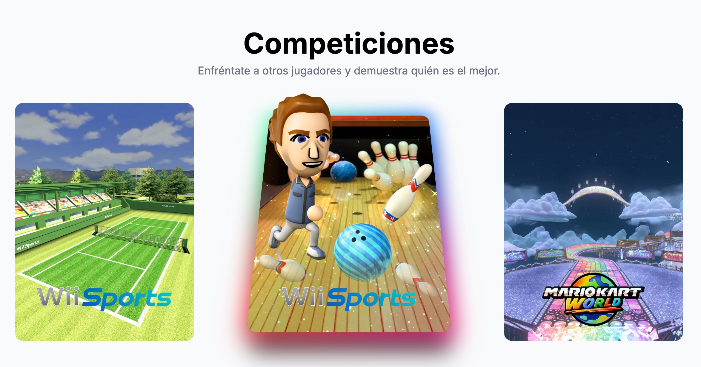
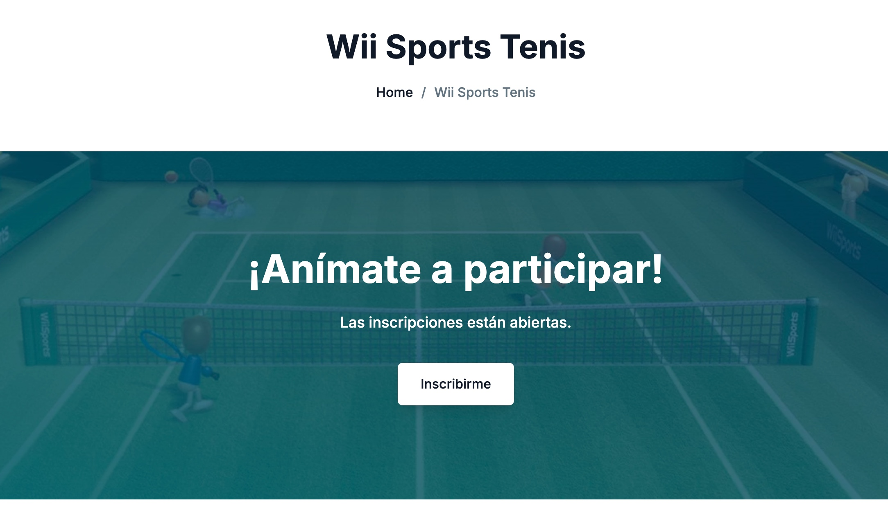
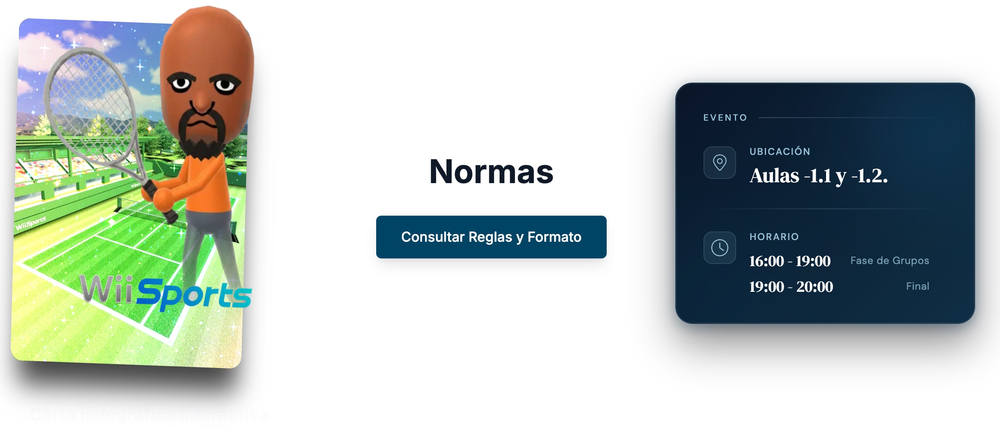
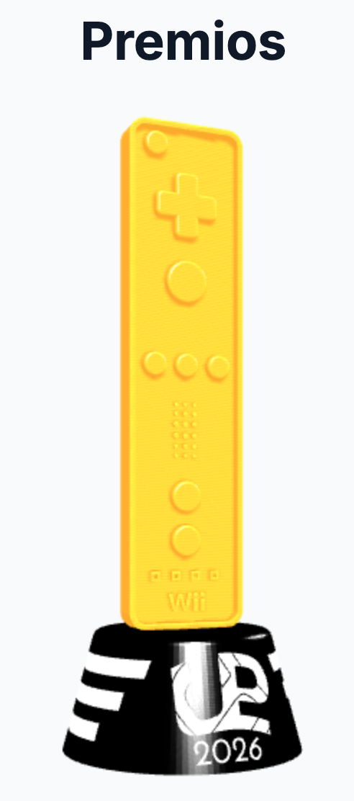
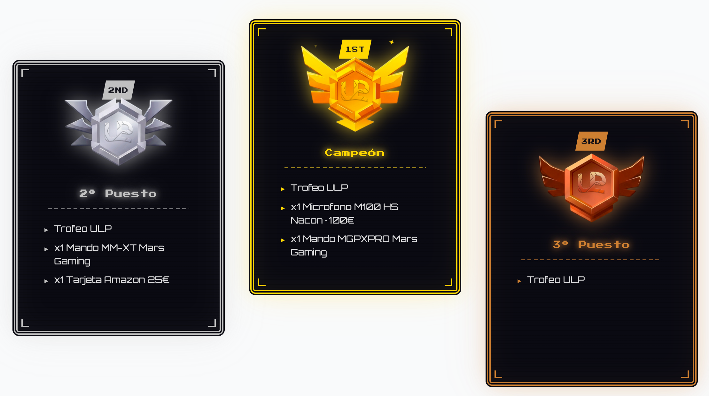
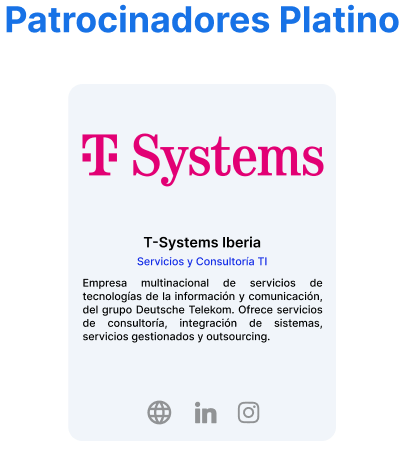
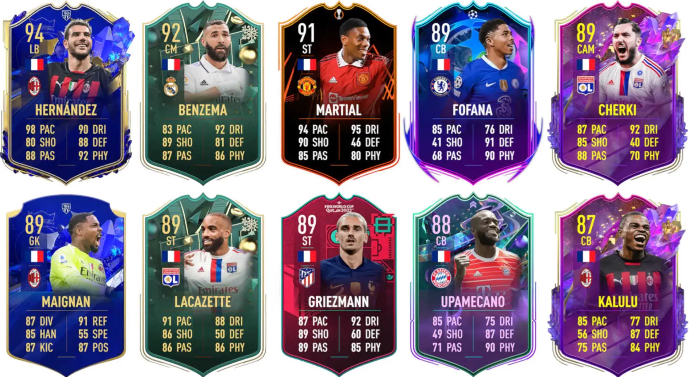
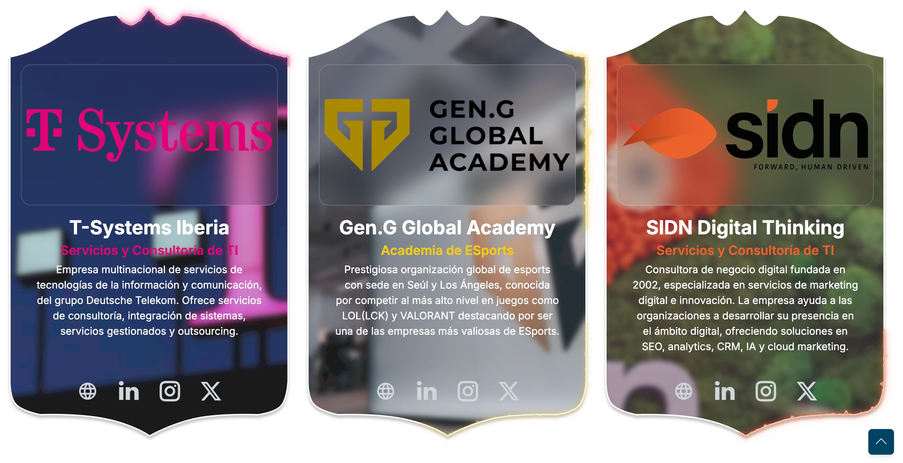

import { YouTube } from '@astro-community/astro-embed-youtube'

# ULP: Diseño e implementación

Si vienes de la **ETSIIT** en la Universidad de Granada, seguramente ya sepas de qué hablo. Pero para los que no, la **ULP (UGR Lan Party)** es ese evento anual donde convertimos la facultad en la zona deseada por todo niño amante de los videojuegos 🎮

Es un evento **sin ánimo de lucro**, montado gracias a la pasión y dedicación de profesores, alumnos y egresados. Consiste en organizar torneos de los juegos del momento, junto con rincones de juego libre que contienen desde consolas retro hasta los juegos recién publicados, simuladores de conducción, realidad virtual, futbolín y hackathones. Todo esto es posible gracias al material que compartimos entre todos y al apoyo de entidades de la UGR y empresas colaboradoras.

### Mi viaje en la ULP (Ediciones 2024, 2025, 2026,...)

Llevo tres años colaborando con el grupo y aportando mi granito de arena donde pueda, pasando por distintos equipos y funciones:

- **Streaming y Contenido:** En la edición 2025 nos estrenamos en nuestro Streaming con nuestro primer IRL (in real Life), llevándolo al siguiente nivel en la edición 2026. Mostramos en directo a nuestros espectadores las distintas zonas, entrevistas y competiciones del evento 📡
- **Organización de Torneos:** En 2024, 2025 y 2026 organicé junto con otros compañeros el torneo de Mario Kart 🏎️
- **Desarrollador Web:** Aquí es donde he probado mi creatividad como desarrollador, trabajando en la **web oficial del proyecto** para tematizarla más con el evento, y no tanto con la seriedad de la web de una institución pública.

### Lo que viene a continuación...

En las próximas secciones de este post, abordamos el **proceso de diseño e implementación** de la sección de Competiciones de la web oficial, de las cuales me encargué personalmente de su desarrollo.

---

## 🛠️ Rediseño del Módulo de Actividades

Para la edición 2025 de la ULP, me encargué de mejorar el apartado de competiciones. Buscábamos crear una **estética más relacionada con los videojuegos**.

### Punto de partida

La implementación anterior basaba el acceso a los torneos en un menú desplegable dentro de la barra de navegación. Los cuales nos llevan a la página específica de cada competición.

Dentro de la página de cada competición encontramos las siguientes secciones:

- Título del juego - Inscripción - Reglas - Premios - Ubicación.

### Ideas e inspiración 💡

Como nueva estructura, me pareció mejor idea tener en la barra de navegación un apartado de competiciones que directamente nos lleve a una página con el listado de competiciones.
Así que investigué ideas para la forma de presentar cada competición en ese listado.

Buscaba ideas chulas y relacionadas con la temática videojuegos para representar originalmente cada competición en el listado.
Nos ubicamos temporalmente en enero de 2025 y el juego que lo está petando en el momento es **[Pokemon TCG Pocket](https://tcgpocket.pokemon.com/es-es/)**, lanzado en diciembre de 2024.

Consiste en la versión para smartphone del tradicional juego de cartas coleccionables de Pokemon. Su elemento principal son obviamente las cartas, las cuales están muy curradas visualmente
y tienen unas animaciones y efectos espectaculares ✨

Con la idea de representar cada juego con una especie de carta Pokémon, busqué ideas por internet e implementaciones de casos parecidos que sirviesen como inspiración. Con su logo, imagen de fondo y personaje.

### Carta de Actividad 🃏

El componente resultante es una tarjeta interactiva con dos estados:

1. **Estado Reposo:** Presenta la carta de frente con el logo en la parte inferior.
2. **Estado Activo (Hover/Focus):** La carta se inclina hacia atrás y aparece desde abajo un personaje.

Para obtener un toque más especial en el estado activo, añadí 2 efectos más:

- **Borde de colores con movimiento**: en Pokemon TCG algunas de las cartas especiales tienen un borde estático colorido. Para darle un toque diferente, le añadí **movimiento circular**.
- **Capa brillante a carta**: de nuevo en Pokemon TCG, tanto en cartas físicas como las virtuales, encontramos cartas especiales que tienen un **efecto holográfico brillante**.

#### Implementación

Quedaría un componente Astro con la siguiente jerarquía semántica:

```html
<section class="competition-card">
	<picture class="card">
		
	</picture>
	
	
</section>
```

El componente de la carta al completo está representado por el `<section>`. Dentro contiene 3 elementos: los que serán la imagen de fondo de la carta, el logo y el personaje del juego.
La imagen de fondo de la carta está envuelta en un `picture`, para separar el estilo de lo que es la imagen de fondo y lo que sería la carta en sí.

Empezaremos destripando la carta, que es lo más interesante.
Se encuentra en el estado base, donde está estática y sin vida por el momento.
Al hacer hover o clicar sobre ella ocurre la **magia** ✨
La imagen transiciona a un estado con una **transformación de rotación en el eje X**, inclinando la carta hacia arriba.
Además, mediante los pseudoelementos `before` y `after`, añadimos 2 efectos chulísimos a la animación.
Añadimos una animación de **borde de neón difuminado multicolor**, donde los colores varían por todo el borde de la carta.
Con el otro pseudoelemento, añado un efecto brillante mediante un gif con partículas y unos colores que simulan el efecto holográfico de las cartas reales.

Además de esa animación, se muestra el personaje **representativo** del juego que estaba oculto. Aparece desde abajo con una animación y tiene un desvanecimiento en la parte inferior.

El logo permanece estático e **inerte**, desplazándose un poco hacia arriba cuando pasa a estado activo para mantener coherencia con la rotación de la carta.



## Página de cada Actividad

Una vez el usuario entra en la página de una competición concreta, se encuentra con varias secciones pensadas para darle **toda la información necesaria** de una forma que no rompa la estética del evento.

### Inscripción y Participantes 📋

En la parte superior de la página aparece el apartado de inscripción, con una imagen de fondo temática de la actividad. Si el plazo de inscripción al torneo está abierto, el usuario puede apuntarse directamente desde aquí con un **formulario sencillo**.

<div style={{ width: '100%', height: 'auto', display: 'block', margin: '0 auto' }}>
	
</div>

El objetivo era que este bloque fuese funcional pero sin restarle protagonismo al resto del contenido, así que se mantuvo **compacto y bien integrado** visualmente con la paleta del evento.

### Carta Animada, Normas y Horario 📅

En cuanto a las normas y horario, es un apartado más sencillo. El botón de normas dirige a un documento donde se encuentran redactadas. El horario y lugar se muestran indicando el aula y horario de las fases decisivas de la competición.

En cuanto a la carta, quise añadirla también en esta sección, pero darle otro tipo de animación.
Para ello, quería ofrecerle un toque de **profundidad 3D** en sus elementos y un **efecto holográfico reflectante** como tienen las del juego y las originales.

<div style={{ width: '100%', height: 'auto', display: 'block', margin: '0 auto' }}>
	
</div>

La carta ofrece una **animación de inclinación 3D** al pulsar o hacer hover en ella. Y además tiene una animación donde se mueve sola y tiene el efecto reflectante.

### Trofeo 3D y Premios 🏆

El bloque de premios es, visualmente, el más llamativo de la página. Para representar el primer puesto se muestra un **trofeo en 3D** renderizado directamente en el navegador con **Three.js**.

Los modelos fueron creados por el propio equipo de diseño del staff en **Blender**, exportados en formato `.obj` y su material en `.mtl`. El trofeo está en una escena flotando y rotando **continuamente** para observarse desde todos los ángulos. Además cuenta con varias luces para mostrar reflejos y sombras.

Esta sección es **interactiva**, cuenta con un efecto de pulso que llama a ello. Se puede rotar y ampliar la vista del trofeo al gusto del usuario, permitiendo observar todos los detalles del diseño.

<div
	style={{
		width: '150px',
		height: 'auto',
		display: 'flex',
		justifyContent: 'center',
		margin: '0 auto'
	}}
>
	
</div>

En la siguiente sección, se **encuentra** el listado de premios para el podio de participantes. Representados por unas cartas con **estilo y tipografía retro**, junto con unos emblemas tematizados del logo del evento, inspirados en los rangos de juegos competitivos como LoL o Clash Royale.

<div
	style={{
		width: '100%',
		height: 'auto',
		display: 'flex',
		justifyContent: 'center',
		margin: '0 auto'
	}}
>
	
</div>

---

## Carta de Patrocinador 🤝

Partimos de la siguiente base de la edición anterior.

<div
	style={{
		width: '100%',
		height: 'auto',
		display: 'flex',
		justifyContent: 'center',
		margin: '0 auto'
	}}
>
	
</div>

Dado que la información sería la misma, busqué otra idea de mostrar a los patrocinadores con un **estilo más gamer**.
Siguiendo con el estilo de cartas en juegos, me pareció adecuado usar como inspiración las cartas del juego mítico **FIFA**.

<div
	style={{
		width: '100%',
		height: 'auto',
		display: 'flex',
		justifyContent: 'center',
		margin: '0 auto'
	}}
>
	
</div>

Teniendo el concepto en mente, quedó la siguiente implementación.
Manteniendo la forma de la carta de FIFA, una **imagen representativa de fondo** y un **efecto de cristal** en el logo.

<div
	style={{
		width: '100%',
		height: 'auto',
		display: 'flex',
		justifyContent: 'center',
		margin: '0 auto'
	}}
>
	
</div>
